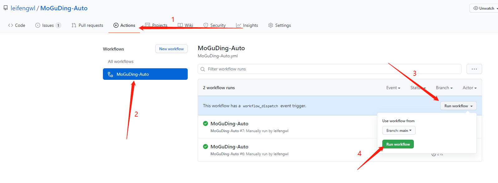

<div align="center">
<h1 align="center">
MoGuDing-Auto
</h1>
</div>


## 项目简介

蘑菇丁每日上下班打卡，支持多账户，指定地区，后续将添加日报周报等功能

## 项目功能

***当前版本:  20210801***

1. 定时上下班自动打卡
2. 支持指定地区
3. 支持多用户

## 更新日志

### 2021-08-01:

1. 定时上下班自动打卡
2. 支持指定地区
3. 支持多用户


## 使用说明

### Actions 方式

1. **Fork 本项目**

2. **点击项目 Settings -> Secrets -> New Secrets 添加Secrets，其中server酱微信推送的sckey可参阅[微信订阅通知](#微信订阅通知)**

| Name                 | Value                                                        | 是否必填 |
| -------------------- | ------------------------------------------------------------ | -------- |
| PERSONAL_INFORMATION | 看下面例子详细介绍                                           | 必填     |
| SERVERPUSHKEY        | server酱推送的sckey                                          | 非必填   |
| TG_BOT_TOKEN         | Telegram推送服务Token                                        | 非必填   |
| TG_USER_ID           | Telegram推送服务UserId                                       | 非必填   |
| BARK                 | bark消息推送服务,secrets可填;形如jfjqxDx3xxxxxxxxSaK的字符串 | 非必填   |
| PUSHPLUS             | pushplus推送服务Token                                        | 非必填   |
| ACCESSTOKEN          | 企业微信access_token                                         | 非必填   |
| CORPID               | 企业ID（如果已经填写ACCESSTOKEN  则无需填写这个）            | 非必填   |
| CORPSECRET           | 应用的凭证密钥secret（如果已经填写ACCESSTOKEN  则无需填写这个） | 非必填   |
| TOUSER               | touser指定接收消息的成员  默认为“@all”                       | 非必填   |
| AGENTID              | agentid企业应用的id                                          | 非必填   |
| THUMB_MEDIA_ID       | 企业微信素材库图片id                                         | 非必填   |
| AUTHOR               | 企业微信文章作者名字                                         | 非必填   |

***PERSONAL_INFORMATION***     变量填写例子：
注意！这个必填的变量值为一个json形式:

使用时请删除注释！！！

一个账户：

```json
[
  {
    "phone": "你的手机号", # 账号
    "password": "你的密码", # 密码
    "token": "123", #抓包获取token，在请求头中为 authorization
    "country": "中国", # 国家
    "province": "江西省", # 省份
    "city": "萍乡市", # 城市  
    "address": "中国江西省萍乡市芦溪县东南边境", # 详细地址
    "latitude": "27.467943", # 纬度
    "longitude": "114.17542" # 经度
  },
  
]
```

多个账户：

```json
[
  {
    "phone": "你的手机号", # 账号
    "password": "你的密码", # 密码
    "token": "", #抓包获取token，在请求头中为 authorization，不会抓包请留空，不要删除
    "country": "中国", # 国家
    "province": "江西省", # 省份
    "city": "萍乡市", # 城市  
    "address": "中国江西省萍乡市芦溪县东南边境", # 详细地址
    "latitude": "27.467943", # 纬度
    "longitude": "114.17542" # 经度
  },
  {
    "phone": "你的手机号", # 账号
    "password": "你的密码", # 密码
    "token": "123", #抓包获取token，在请求头中为 authorization
    "country": "中国", # 国家
    "province": "江西省", # 省份
    "city": "萍乡市", # 城市  
    "address": "中国江西省萍乡市芦溪县东南边境", # 详细地址
    "latitude": "27.467943", # 纬度
    "longitude": "114.17542" # 经度
  }
  
]
```

经纬度查询推荐使用高德：https://lbs.amap.com/tools/picker


## 为什么需要token？

### 区别：

无token：每次都是重新登录，会导致app上的账户被挤下线

有token：每次使用token登录，不影响app的账户在线状态


1. **开启 Actions 并触发每日自动执行**

**Github Actions 默认处于关闭状态，需要手动开启 Actions ，执行一次工作流，验证是否可以正常工作。**



如果需要修改每日任务执行的时间，请修改 `.github/workflows/MoGuDing-Auto.yml`，在第 7行左右位置找到下如下配置。

```yml
  schedule:
    - cron: '30 0 * * *'
    # cron表达式，Actions时区是UTC时间，需要往前推8个小时  此时为8点30推送
    # 示例： 每天晚上22点30执行 '30 14 * * *'
```

## 订阅通知

### 订阅执行结果

目前Turbo版本的消息通道支持以下渠道

- 企业微信应用消息
- Android
- Bark iOS
- 企业微信群机器人
- 钉钉群机器人
- 飞书群机器人
- 自定义微信测试号
- 方糖服务号

1. 前往 [sct.ftqq.com](https://sct.ftqq.com/sendkey)点击登入，创建账号。
2. 点击点[SendKey](https://sct.ftqq.com/sendkey) ，生成一个 Key。将其增加到 Github Secrets 中，变量名为 `SERVERPUSHKEY`
3. [配置消息通道](https://sct.ftqq.com/forward) ，选择方糖服务号，保存即可。
4. 推送效果展示
   
