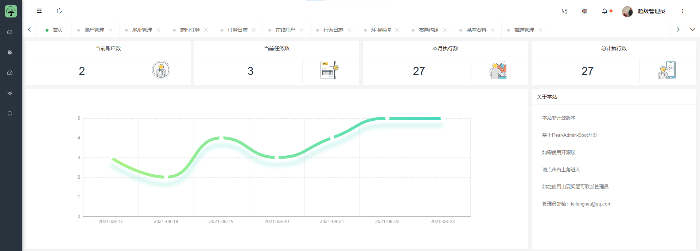
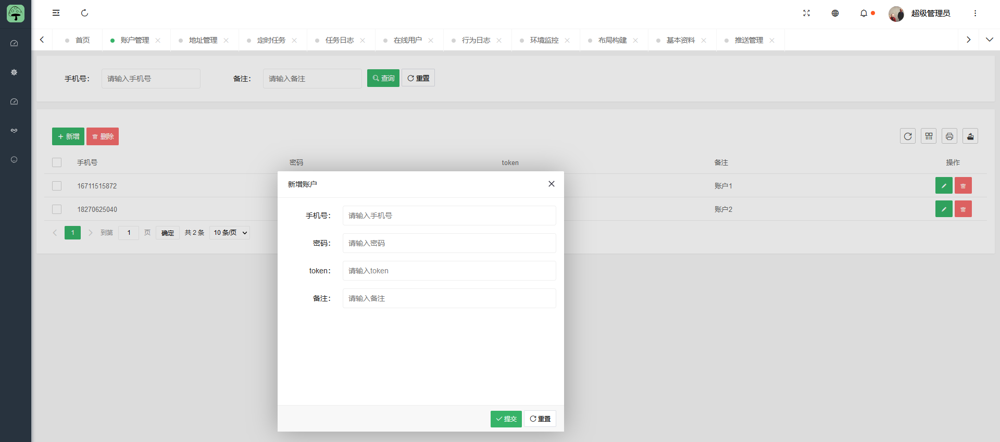
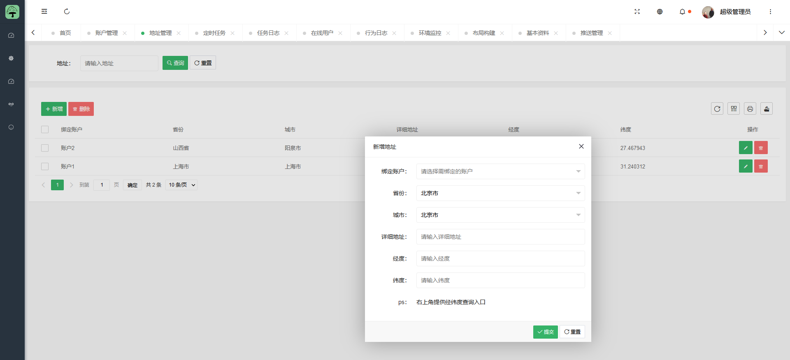
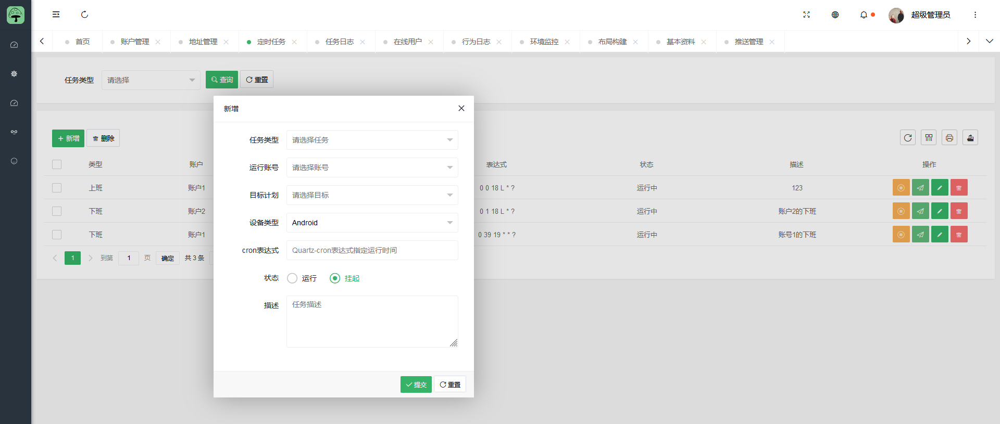
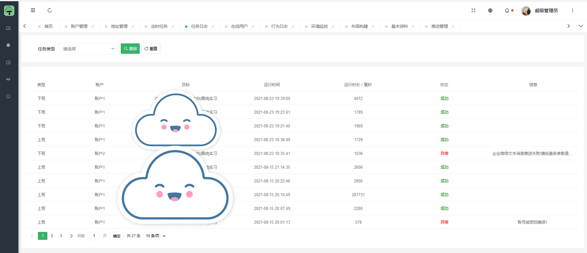

<div align="center">
<h1 align="center">
MoGuDing-Auto
</h1>
</div>


## 项目简介
蘑菇丁X工学云每日上下班打卡，支持多账户，指定地区，多种推送方式

新官网：
WEB版本(亿诺自动化平台)：[点击进入](https://auto.hbee.me/)

备用网址(亿诺自动化平台)：[点击进入](https://auto.smallbee.me/)

原官网（已弃用）：~~auto.亿诺.cc~~

目前WEB版已支持

✔️工学云

✔️蘑菇丁

✔️习讯云

✔️习讯宁夏

✔️黔职通

✔️校友邦

✔️职校家园

✔️实习备案

✔️慧职教

✔️掌上卫职

✔️校企E站

✔️广西职业院校学生实习管理平台

✔️学习通(实习)

✔️江西职教实习

✔️江西智慧教育

✔️习行(学生版)

✔️移动教务

✔️成学云实习实训助手

支持每日自动上下班打卡，自动发表日周月报，总结，健康上报，

支持发表图片，支持多账户，指定地区，多种推送方式，支持批量导入实习账号，批量补卡补日周月报


请不要使用本开源程序在服务器上跑(包括GitHub的Actions)！！！

请不要使用本开源程序在服务器上跑(包括GitHub的Actions)！！！

请不要使用本开源程序在服务器上跑(包括GitHub的Actions)！！！

微信交流群:


## 项目功能

***当前版本:  20210915***

1. 定时上下班自动打卡
2. 支持指定地区
3. 支持多用户
4. 支持多种推送方式
5. 支持自定义设备
6. 支持本地文件配置


## 更新日志
### 2021-09-15:

1. 支持本地文件配置
2. 账号单独推送

### 2021-08-26:

1. 自定义设备
2. 修复死循环

### 2021-08-01:

1. 定时上下班自动打卡
2. 支持指定地区
3. 支持多用户


## 使用说明

### Actions 方式

1. **Fork 本项目**

2. **点击项目 Settings -> Secrets -> New Secrets 添加Secrets，其中server酱微信推送的sckey可参阅[微信订阅通知](#微信订阅通知)**

| Name                 | Value                                                        | 是否必填 |
| -------------------- | ------------------------------------------------------------ | -------- |
| PERSONAL_INFORMATION | 看下面例子详细介绍                                           | 必填     |
| SERVERPUSHKEY        | server酱推送的sckey                                          | 非必填   |
| TG_BOT_TOKEN         | Telegram推送服务Token                                        | 非必填   |
| TG_USER_ID           | Telegram推送服务UserId                                       | 非必填   |
| BARK                 | bark消息推送服务,secrets可填;形如jfjqxDx3xxxxxxxxSaK的字符串 | 非必填   |
| PUSHPLUS             | pushplus推送服务Token                                        | 非必填   |
| ACCESSTOKEN          | 企业微信access_token                                         | 非必填   |
| CORPID               | 企业ID（如果已经填写ACCESSTOKEN  则无需填写这个）            | 非必填   |
| CORPSECRET           | 应用的凭证密钥secret（如果已经填写ACCESSTOKEN  则无需填写这个） | 非必填   |
| TOUSER               | touser指定接收消息的成员  默认为“@all”                       | 非必填   |
| AGENTID              | agentid企业应用的id                                          | 非必填   |
| THUMB_MEDIA_ID       | 企业微信素材库图片id                                         | 非必填   |
| DING_PUSH_TOKEN      | 钉钉机器人的WebHook(添加关键词“签到”)                         | 非必填|


***PERSONAL_INFORMATION***     变量填写例子：
注意！这个必填的变量值为一个json形式:

使用时请删除注释！！！

使用时请删除注释！！！

使用时请删除注释！！！

如果使用是本地文件配置方式，请将下方配置填写到“information.json”文件中

一个账户：

```json
[
  {
    "phone": "你的手机号", # 账号
    "password": "你的密码", # 密码
    "device": "Android", # 设备  Android或者iOS
    "token": "123", #抓包获取token，在请求头中为 authorization
    "country": "中国", # 国家
    "province": "江西省", # 省份
    "city": "萍乡市", # 城市  
    "address": "中国江西省萍乡市芦溪县东南边境", # 详细地址
    "latitude": "27.467943", # 纬度
    "longitude": "114.17542", # 经度
    "SERVERPUSHKEY": "", # Server酱推送
    "TG_BOT_TOKEN": "",  # Telegram推送服务Token
    "TG_USER_ID": "", # Telegram推送服务UserId
    "BARK": "", # bark消息推送服务,自行搜索; secrets可填;形如jfjqxDx3xxxxxxxxSaK的字符串
    "PUSHPLUS": "", # PUSHPLUS消息推送Token
    "ACCESSTOKEN": "", # 企业微信access_token
    "CORPID": "", # 企业ID  （如果已经填写ACCESSTOKEN  则无需填写这个）
    "CORPSECRET": "", # 应用的凭证密钥  （如果已经填写ACCESSTOKEN  则无需填写这个）
    "TOUSER": "", # touser指定接收消息的成员  默认为全部
    "AGENTID": "", # agentid企业应用的id
    "THUMB_MEDIA_ID": "" ,# 企业微信素材库图片id
    "DING_PUSH_TOKEN": "" # 钉钉机器人推送webhook
  }
  
]
```

多个账户：

```json
[
  {
    "phone": "你的手机号", # 账号
    "password": "你的密码", # 密码
    "device": "Android", # 设备  Android或者iOS
    "token": "", #抓包获取token，在请求头中为 authorization，不会抓包请留空，不要删除
    "country": "中国", # 国家
    "province": "江西省", # 省份
    "city": "萍乡市", # 城市  
    "address": "中国江西省萍乡市芦溪县东南边境", # 详细地址
    "latitude": "27.467943", # 纬度
    "longitude": "114.17542", # 经度
    "SERVERPUSHKEY": "", # Server酱推送
    "TG_BOT_TOKEN": "",  # Telegram推送服务Token
    "TG_USER_ID": "", # Telegram推送服务UserId
    "BARK": "", # bark消息推送服务,自行搜索; secrets可填;形如jfjqxDx3xxxxxxxxSaK的字符串
    "PUSHPLUS": "", # PUSHPLUS消息推送Token
    "ACCESSTOKEN": "", # 企业微信access_token
    "CORPID": "", # 企业ID  （如果已经填写ACCESSTOKEN  则无需填写这个）
    "CORPSECRET": "", # 应用的凭证密钥  （如果已经填写ACCESSTOKEN  则无需填写这个）
    "TOUSER": "", # touser指定接收消息的成员  默认为全部
    "AGENTID": "", # agentid企业应用的id
    "THUMB_MEDIA_ID": "" , # 企业微信素材库图片id
    "DING_PUSH_TOKEN": "" # 钉钉
  },
  {
    "phone": "你的手机号", # 账号
    "password": "你的密码", # 密码
    "device": "Android", # 设备  Android或者iOS
    "token": "123", #抓包获取token，在请求头中为 authorization
    "country": "中国", # 国家
    "province": "江西省", # 省份
    "city": "萍乡市", # 城市  
    "address": "中国江西省萍乡市芦溪县东南边境", # 详细地址
    "latitude": "27.467943", # 纬度
    "longitude": "114.17542", # 经度
     "SERVERPUSHKEY": "", # Server酱推送
    "TG_BOT_TOKEN": "",  # Telegram推送服务Token
    "TG_USER_ID": "", # Telegram推送服务UserId
    "BARK": "", # bark消息推送服务,自行搜索; secrets可填;形如jfjqxDx3xxxxxxxxSaK的字符串
    "PUSHPLUS": "", # PUSHPLUS消息推送Token
    "ACCESSTOKEN": "", # 企业微信access_token
    "CORPID": "", # 企业ID  （如果已经填写ACCESSTOKEN  则无需填写这个）
    "CORPSECRET": "", # 应用的凭证密钥  （如果已经填写ACCESSTOKEN  则无需填写这个）
    "TOUSER": "", # touser指定接收消息的成员  默认为全部
    "AGENTID": "", # agentid企业应用的id
    "THUMB_MEDIA_ID": "", # 企业微信素材库图片id
    "DING_PUSH_TOKEN": "" # 钉钉
  }
  
]
```

经纬度查询推荐使用高德：https://lbs.amap.com/tools/picker


## 为什么需要token？

### 区别：

无token：每次都是重新登录，会导致app上的账户被挤下线

有token：每次使用token登录，不影响app的账户在线状态


1. **开启 Actions 并触发每日自动执行**

**Github Actions 默认处于关闭状态，需要手动开启 Actions ，执行一次工作流，验证是否可以正常工作。**


如果需要修改每日任务执行的时间，请修改 `.github/workflows/MoGuDing-Auto.yml`，在第 7行左右位置找到下如下配置。

```yml
  schedule:
    - cron: '30 0 * * *'
    # cron表达式，Actions时区是UTC时间，需要往前推8个小时  此时为8点30推送
    # 示例： 每天晚上22点30执行 '30 14 * * *'
```

## 订阅通知

### 订阅执行结果

目前Turbo版本的消息通道支持以下渠道

- 企业微信应用消息
- Android
- Bark iOS
- 企业微信群机器人
- 钉钉群机器人
- 飞书群机器人
- 自定义微信测试号
- 方糖服务号

1. 前往 [sct.ftqq.com](https://sct.ftqq.com/sendkey)点击登入，创建账号。
2. 点击点[SendKey](https://sct.ftqq.com/sendkey) ，生成一个 Key。将其增加到 Github Secrets 中，变量名为 `SERVERPUSHKEY`
3. [配置消息通道](https://sct.ftqq.com/forward) ，选择方糖服务号，保存即可。
4. 推送效果展示
   
   
   
## WEB版展示
WEB版基于Pear-Admin-Boot编写







